# Logical Containers

Two bounded contexts (Build-Time, Run-Time) plus shared contract boundaries. External systems: the **Backend** or Backends (sovereign systems of record — Resources may bind to different ones), the **Object Store** (configured binary storage beside the Backend), the **Schema Source**, and the **operating system shell** (window management; link handling at P1).

---

## Build-Time Context

### B1 — Introspection Frontends

- **Logical Type:** Offline CLI tool (adapter set).
- **Responsibility:** Read one class of Schema Source — database catalog or machine-readable API description — and emit identical, source-neutral Snapshot semantics (types, nullability, defaults, server-owned fields, relations).
- **Inputs:** A reachable Schema Source, only at explicit invocation. Never during a build.
- **Outputs:** A Schema Snapshot (handed to B2).
- **Depends on:** The Snapshot format contract (owned by B2). Two frontends existing from v1 is what forces that contract to stay neutral (CAP-102).

### B2 — Schema Snapshot Store

- **Logical Type:** Committed repository artifact (storage boundary).
- **Responsibility:** Hold machine-owned, versioned, human-reviewable captures of external truth — one namespaced Snapshot per bound Provider/Source pair. Content includes type-faithful temporal kinds, exact-numeric scalars, nullability, server-owned classification, unique constraints, enums, relations, Junction candidates (dual-FK tables), and self-referencing Relation flags. Discipline: regeneration always overwrites; hand-edits are prohibited; every schema change appears as a reviewable diff (CAP-101).
- **Inputs:** Snapshots from B1.
- **Outputs:** Snapshot content consumed by B3 and B4 via file handoff.
- **Depends on:** Nothing at run time. This artifact is why builds are air-gap-compatible (NFC-11).

### B3 — Scaffolder

- **Logical Type:** Offline CLI tool.
- **Responsibility:** One-time materialization of a Resource declaration from Snapshot truth: inferred labels, input kinds, requiredness, Relations, and Projections written out as explicit, thereafter Adopter-owned code (CAP-103). Never regenerates over owned declarations.
- **Inputs:** Schema Snapshot (B2), target Resource selection.
- **Outputs:** Adopter-owned Resource declarations.
- **Depends on:** B2 only (hermetic).

### B4 — Derivation & Verification Engine

- **Logical Type:** Build-step library boundary.
- **Responsibility:** At build time, unify owned declarations with Snapshot truth into the statically specialized artifacts the client consumes — typed Record shapes, per-Resource **typed field identity** (the single key reused by Filters, sort, Projections, sparse patches, invalidation, and validation routing), and per-Resource View/form derivations. Any contradiction (Drift) fails the build with a message naming the exact stale declaration (CAP-104, NFC-12).
- **Inputs:** Resource declarations + Schema Snapshot (file handoff).
- **Outputs:** Verified typed artifacts baked into the client; build failure signals.
- **Depends on:** B2. **Deletion test:** removing it disperses type verification into every runtime container and reintroduces runtime schema errors — the exact failure class the product exists to kill.

---

## Shared Contract Boundary

### C1 — Provider Contract & Conformance Suite

- **Logical Type:** Library boundary + executable test harness.
- **Responsibility:** Define the Provider contracts — singular and bulk reads/writes over windowed lists, sparse mutations carrying previous-state, structured error taxonomy, advisory permission vocabulary, and the Capability declarations (realtime change feed, cursor paging, conditional update, counting); plus the independent ObjectStore port contract; prove any implementation against them (CAP-601/602/603). First-party implementations are consumers with no private privileges.
- **Inputs:** A candidate Provider implementation.
- **Outputs:** Conformance verdicts; the contract consumed by R1 and by Contributors (CAP-1003).
- **Depends on:** Nothing else in the system — deliberately, so third parties can build against it in isolation.

---

## Run-Time Context (single process; all containers shared by every Workspace window)

### R1 — Provider Gateway

- **Logical Type:** Port/boundary (hexagonal edge), instantiated per declared Provider Binding.
- **Responsibility:** Sole communication path to its Backend. Translates typed requests — including bulk forms — into Backend-specific transport; surfaces declared Capabilities to the rest of the client; normalizes every failure into the structured error taxonomy (unauthenticated / forbidden / not-found / unsupported-query / field-validation / conflict / transport / provider-internal); hosts the optional change-feed channel including reconnect detection; exposes per-binding connectivity state.
- **Inputs:** Typed read/window/mutation requests routed by Resource Binding (in-process, async request-response); change-feed events (async event stream, when the Capability exists).
- **Outputs:** Typed results and normalized errors to R2/R3; connectivity state to R5/R8; feed events to R2.
- **Depends on:** Its bound external Backend; C1 contracts.

### R10 — Object Store Port

- **Logical Type:** Port/boundary (hexagonal edge) + first-party adapter.
- **Responsibility:** The only path to binary-object storage: put/get/delete objects, progress surfacing, and best-effort cleanup deletion with orphan reporting to R8. Independent of the data Provider by design; absent configuration, callers degrade honestly (reference-as-text fields) rather than fail (CAP-608).
- **Inputs:** Object bytes and lifecycle commands from R3 (dispatch-time upload/cleanup).
- **Outputs:** Object references into mutation payloads; progress/error events to R6/R5.
- **Depends on:** The configured external Object Store; nothing else in the client.
- **Deletion test:** folding it into R1 would couple record truth to storage vendors and forfeit the unconfigured-degradation path.

### R2 — Resource Replica

- **Logical Type:** In-memory state authority (one logical instance per Resource, statically specialized).
- **Responsibility:** Authoritative client-side truth for one Resource: normalized record store with per-record fault containment (CAP-205); query entries holding window state, memoized joined views, freshness age, and a generation counter that discards stale responses; the pending-change overlay applied at read time; field-aware invalidation (membership/order changes → refetch; display-only changes → in-place patch); last-write-wins reconciliation of feed events; staleness-driven refetch and eviction of unobserved queries. Exposes an observation surface so Views react to change, and an introspection surface for R8. Observed-status is tracked by framework-owned observation guards (registered on mount, released on drop) — deliberately independent of any substrate observer mechanism, which offers no count introspection.
- **Inputs:** Fetched results and feed events (from R1), overlay commands (from R3), window demands and observation registrations (from R6 via R4).
- **Outputs:** Read-time query views; change notifications (in-process observation pattern).
- **Depends on:** R1. **Depth standard:** smallest interface (read view, request window, observe) hiding the system's deepest complexity.

### R3 — Mutation Coordinator

- **Logical Type:** In-process orchestrator.
- **Responsibility:** The mutation lifecycle: stage a Pending Change (overlay via R2) and run its Undo Window — revocation means the change is *never dispatched* (CAP-303); enforce per-Record FIFO dispatch; for file/image mutations, upload via R10 first and only then dispatch the record write (object-first ordering: uploads begin at dispatch, after the Undo Window, so revocation never leaves an uploaded object; record rejection or transport failure triggers best-effort cleanup); dispatch bulk operations through the contract's bulk forms; settle outcomes — confirmation graduates the change, rejection rolls back the overlay, preserves Operator input, routes field-validation errors to the owning form (R6) and everything else to the feedback surface (R5) even when the form is gone (CAP-302/304/305).
- **Inputs:** Mutation intents from R6; settlement results from R1; object lifecycle commands/results with R10 (upload at dispatch, cleanup on failure).
- **Outputs:** Overlay commands to R2; feedback events to R5; validation routing to R6; upload/cleanup commands to R10.
- **Depends on:** R1, R2. **Deletion test:** deleting it smears undo timing, ordering, and failure routing across R2, R5, and R6.

### R4 — Resource Registry

- **Logical Type:** Composition & resolution boundary.
- **Responsibility:** Owns the system's only two dynamic-resolution points ("airlocks"): (1) runtime string → concrete Resource handler under the application's declared link scheme, serving Deep Links (with optional typed Query payloads), Saved Query bookmarks, and Workspace restoration through one mechanism (CAP-505/502/208); (2) cross-Resource typed edges for Relations — resolved once and cached, honor each side's Provider Binding and visibly flagging cross-binding edges as structurally-verified-only (CAP-401/403/405). Holds the owning handles that keep Replicas warm (visited *or* referenced); runs startup completeness assertions so an unregistered Relation target or Panel kind fails at launch, not mid-session (CAP-402).
- **Inputs:** Resolution requests from R5/R6; registrations from derived artifacts at startup.
- **Outputs:** Concrete handlers/edges; startup assertion failures.
- **Depends on:** B4's derived artifacts, R2 instances it owns.

### R5 — Workspace Shell

- **Logical Type:** UI orchestration container.
- **Responsibility:** One Workspace per OS window, all in one process: panel tree with split/tab/float; declaration-driven navigation sidebar (grouped resources) and panel breadcrumbs; global command palette (jump-to-resource/record/action, keyboard-first); Follow linkage as panel-local selection observation (browse-only); Edit panels keyed by (Resource, Record) with focus-not-duplicate (CAP-503/504); prev/next record navigation within source-list orderings (CAP-209); destructive-action confirmation gating before staging (CAP-308); Workspace persistence/restore through R9 and R4 (CAP-501/502); Deep Link entry incl. single-instance activation → new Workspace window (CAP-505); OS-following light/dark theming on substrate tokens with Adopter accent (CAP-509); the application-wide feedback surface (notifications, connectivity status, degraded-mode banner); routing of re-authentication interruptions from R7.
- **Inputs:** Operator window/panel actions; restore payloads (R9); feedback events (R3/R1/R7).
- **Outputs:** Mounted Views (R6); persisted layouts (R9).
- **Depends on:** R4, R6, R9, R7.

### R6 — View & Form Engine

- **Logical Type:** UI presentation container (statically specialized per Resource).
- **Responsibility:** The four core Views plus the declaration-derived input catalog. Lists: windowed binding — visible range demands windows from R2, placeholders for unloaded rows, provisional band for pending creations, contained error boundary per drifted Record (CAP-201/202/204/205, 302); typed Filters/sort/Search controls with labeled loaded-window fallback when Search is unsupported (CAP-202/203); operator column masks applied read-only over declared Projections (CAP-207); Quick Edit on simple widgets through the standard mutation lifecycle (CAP-310); m2m multi-select pickers over Junction-filtered queries (CAP-404); hierarchy cues for self-referencing Resources (CAP-212); prev/next navigation affordances fed by source-list orderings (CAP-209). Forms: catalog-driven widgets incl. exact-decimal numbers and type-faithful temporal rendering (CAP-312/211), declarative-rule + closure validation layers preserving typed input, cross-field validation at submission assembly, dirty tracking feeding Draft persistence, Backend validation errors landed on the exact Field with final precedence, and the non-blocking mid-edit drift warning (CAP-301/305/306).
- **Inputs:** Query views and change notifications (R2); validation routing (R3); Operator input.
- **Outputs:** Window demands and observations (R2); mutation intents (R3).
- **Depends on:** R2, R3, R4 (relation edges).

### R7 — Session & Access

- **Logical Type:** Identity boundary.
- **Responsibility:** Pluggable authentication surface with a fully functional none-mode default (CAP-701); session state and identity display; permission *affordance* state — advisory only, corrected by Backend denials, structurally distinct from authorization (P1: CAP-702/703); mid-session expiry raised as an interruption to R5, never handled inside Views.
- **Inputs:** Auth configuration; unauthenticated/forbidden errors from R1.
- **Outputs:** Session state; interruption events to R5; affordance hints to R6.
- **Depends on:** R1.

### R8 — Diagnostics & Logging

- **Logical Type:** Cross-cutting observability container (local only).
- **Responsibility:** Correlated structured logging: every Operator action carries a trace identifier propagated through Gateway calls, feed events, and state changes; developer-mode diagnostics panel over the introspection surfaces of R1/R2/R3 (replica contents, query freshness/generations, pending mutations, declared Capabilities). Nothing ever leaves the machine (NFC-31).
- **Inputs:** Log/trace events from all runtime containers; introspection reads.
- **Outputs:** Local log stream; diagnostics Views (mounted via R5, dev-mode gated).
- **Depends on:** Introspection surfaces of R1/R2/R3.

### R9 — Local State Store

- **Logical Type:** Storage boundary (per-machine).
- **Responsibility:** Persist and restore Workspace layouts, application preferences, per-Resource column masks and sort overrides, Saved Query bookmarks, and form Drafts locally (CAP-502, 207, 208, 309; NFC-22). Never stores credentials in plaintext (NFC-32) or anything shareable — Deep Links deliberately do not pass through here; bookmarks store queries, links stay content.
- **Inputs:** Layout snapshots, masks, bookmarks, and Drafts from R5/R6.
- **Outputs:** Restore payloads to R5/R6.
- **Depends on:** Local filesystem/platform storage facilities.

---

## Container Diagram

```mermaid
C4Container
    title gpui-admin — logical containers
    Person(adopter, "Adopter")
    Person(operator, "Operator")
    System_Ext(schemaSource, "Schema Source", "DB catalog / API description")
    System_Ext(backend, "Backend(s)", "Sovereign system(s) of record")
    System_Ext(objectStore, "Object Store", "Configured binary-object storage")

    Boundary(bt, "Build-Time Context (offline)") {
        Container(b1, "B1 Introspection Frontends", "CLI adapters", "Source → neutral Snapshot semantics")
        Container(b2, "B2 Schema Snapshot Store", "Committed artifact", "Reviewable machine-owned truth")
        Container(b3, "B3 Scaffolder", "CLI", "One-time owned declarations")
        Container(b4, "B4 Derivation & Verification", "Build step", "Typed artifacts; Drift = build failure")
    }

    Boundary(sc, "Shared Contract") {
        Container(c1, "C1 Provider Contract + Conformance Suite", "Library + harness", "Contract, Capabilities, verdicts")
    }

    Boundary(rt, "Run-Time Context (single process, N Workspace windows)") {
        Container(r5, "R5 Workspace Shell", "UI orchestration", "Panels, nav+palette, Follow, restore, feedback")
        Container(r6, "R6 View & Form Engine", "UI presentation", "4 Views, input catalog, windowed lists, typed forms")
        Container(r4, "R4 Resource Registry", "Resolution boundary", "Airlocks, warmth, startup asserts")
        Container(r2, "R2 Resource Replicas", "State authority (per Resource)", "Records, queries, overlay, invalidation")
        Container(r3, "R3 Mutation Coordinator", "Orchestrator", "Undo Window, FIFO, object-first uploads, settlement")
        Container(r1, "R1 Provider Gateways", "Port (per binding)", "Sole Backend paths; error taxonomy; feed")
        Container(r10, "R10 Object Store Port", "Port", "Binary objects; cleanup; orphan reports")
        Container(r7, "R7 Session & Access", "Identity boundary", "Auth surface, affordances")
        Container(r8, "R8 Diagnostics & Logging", "Observability", "Traces, dev panel; local only")
        Container(r9, "R9 Local State Store", "Storage boundary", "Layouts, preferences, masks, bookmarks, drafts")
    }

    Rel(adopter, b1, "invokes", "CLI")
    Rel(b1, schemaSource, "introspects", "network, offline act")
    Rel(b1, b2, "writes Snapshot", "file handoff")
    Rel(b2, b3, "seeds", "file handoff")
    Rel(b2, b4, "verifies against", "file handoff")
    Rel(b3, b4, "declarations consumed by", "file handoff")
    Rel(b4, r4, "typed artifacts registered into", "build output")
    Rel(c1, r1, "contract implemented behind", "library boundary")

    Rel(operator, r5, "arranges & works in", "UI")
    Rel(r5, r6, "mounts Views", "in-process")
    Rel(r5, r9, "persist/restore", "local file I/O")
    Rel(r5, r4, "resolves panels & links", "in-process (string airlock)")
    Rel(r6, r2, "windows, reads, observes", "in-process observation")
    Rel(r6, r3, "submits mutation intents", "in-process")
    Rel(r3, r2, "stages/settles overlay", "in-process")
    Rel(r3, r1, "dispatches (per-Record FIFO)", "async request-response")
    Rel(r2, r1, "fetches windows/records", "async request-response")
    Rel(r1, backend, "reads/writes (bulk incl.)", "network request-response")
    Rel(r3, r10, "uploads/cleans objects at dispatch", "in-process port call")
    Rel(r10, objectStore, "put/get/delete objects", "network request-response")
    Rel(backend, r1, "change feed (Capability)", "async event stream")
    Rel(r7, r1, "session context; error routing", "in-process")
    Rel(r8, r2, "introspects", "in-process, dev-mode")
```

**Exemplar note:** the public showcase application (CAP-1001) is not a container — it is a composition of every run-time container plus one conformance-verified Provider, exercised against a real Backend.
