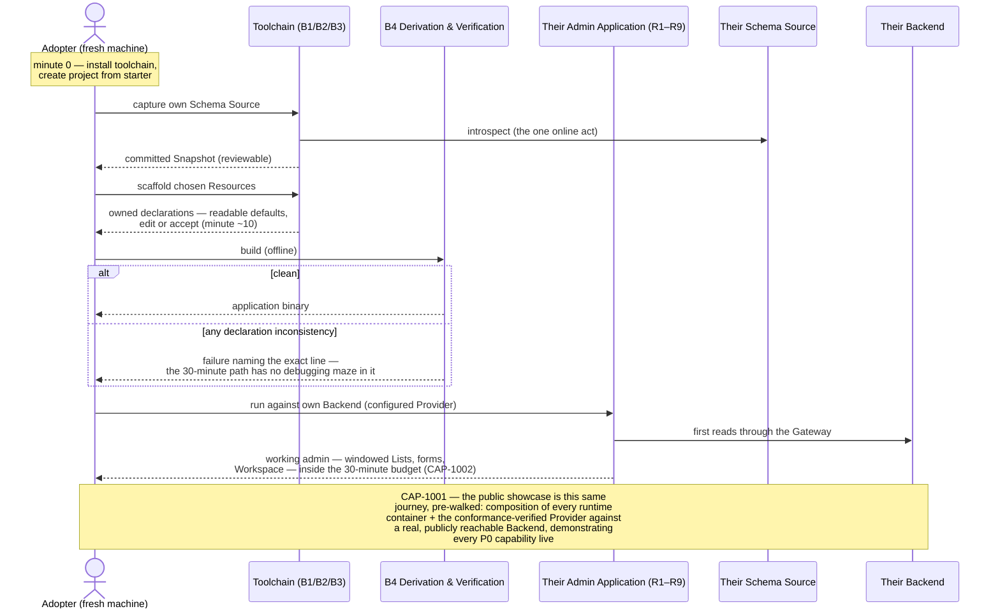

# Flow: Adopter Onboarding & Showcase

**Mapping:** CAP-1001 (public showcase demonstrating every P0 capability against the verified Backend), CAP-1002 (fresh install → working admin over the Adopter's own Schema Source in under 30 minutes).

The adoption funnel as an executable journey. Every minute is architecture-relevant: each step leans on a container designed to make it short.

