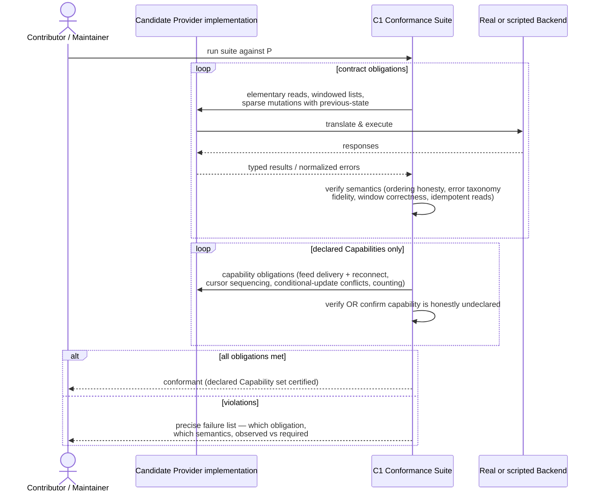

# Flow: Provider Conformance Validation

**Mapping:** CAP-603 (public Conformance Suite validates any Provider). Enables CAP-604 (first-party Provider verified by the same suite) and CAP-1003 (P1 — Contributors prove third-party Providers).

The suite is the contract's executable meaning. Rule RSK-07 binds: a contract change without a suite change is an invalid change.

