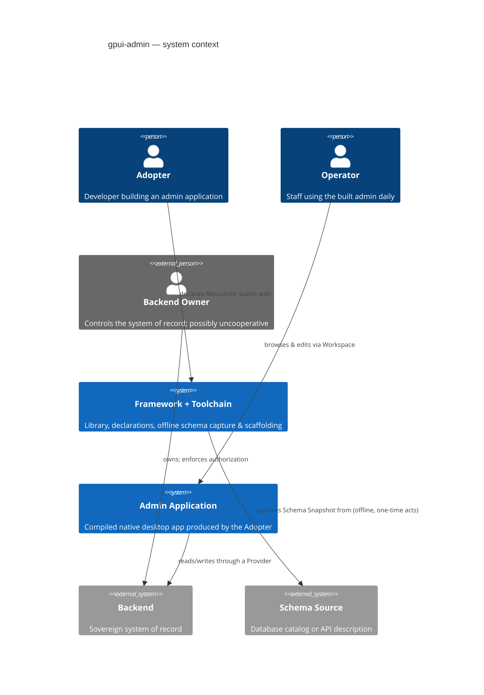

# Domain Model

Conceptual boundaries only; no implementation choices.

## Context



## Domain Concepts

```mermaid
classDiagram
    direction LR

    class SchemaSource
    class SchemaSnapshot
    class Scaffold
    class Resource
    class Field
    class Relation
    class Record
    class View {
        <<List | Show | Create | Edit>>
    }
    class Projection
    class Filter
    class PendingChange {
        undo window
        honest placement
    }
    class Provider
    class Capability {
        <<opt-in>>
        realtime feed
        cursor paging
        conditional update
        counting
    }
    class Backend
    class Workspace
    class Panel
    class Operator

    SchemaSource --> SchemaSnapshot : captured offline into
    SchemaSnapshot --> Scaffold : seeds (one-time)
    Scaffold --> Resource : declares
    Resource "1" *-- "many" Field
    Resource "1" *-- "many" View
    Resource --> Relation : declares
    Relation --> Resource : targets (verified)
    Resource "1" o-- "many" Record
    View --> Projection : displays through
    View --> Filter : constrained by (List)
    Record <-- PendingChange : optimistically alters
    Provider --> Backend : sole communication path
    Provider o-- Capability : declares
    Workspace "1" *-- "many" Panel
    Panel --> View : hosts
    Panel --> Panel : Follows (detail tracks list; browse-only)
    Operator --> Workspace : arranges & resumes
```

## Boundary Statements

- **Truth flows one way at build time:** Schema Source → Schema Snapshot → Scaffold → Resource declarations. Regeneration overwrites Snapshots, never Scaffolds; contradictions between the two halt the build (Drift).
- **Truth flows one way at run time:** the Backend is the only authority on stored data, ordering, membership, and authorization. Pending Changes are honest, revocable local previews — never a second source of truth.
- **The Workspace is personal:** layout state belongs to the Operator's machine. Shared addressing (Deep Link) identifies content, never someone's arrangement.
- **Cooperation is declarative:** everything a Backend *may* offer beyond elementary reads/writes enters the model only as a declared Capability on its Provider.
