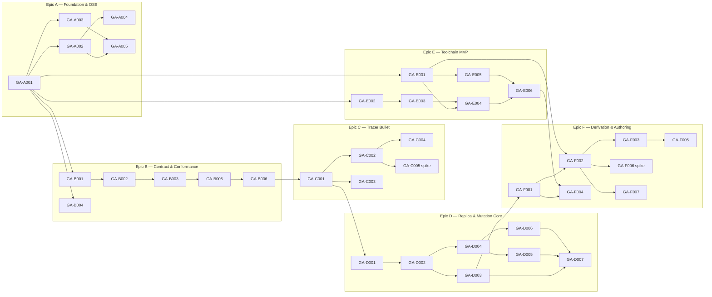

# Critical Path & Build Order

## 0. Version

**v0.1.0** — see [`changelog.md`](./changelog.md).

## Active Backlog Summary

- **Total Active Story Points:** **121** (Epic A: 9 · B: 18 · C: 21 · D: 26 · E: 20 · F: 27 — 36 tickets, 2 of them Spikes)
- **Execution discipline:** one branch per epic (`type/description`), whole-epic squash PR into protected `master`, epics executed serially A → F (interview decision).
- **Critical Path (dependency spine gating Phase 1 completion):**
  1. GA-A001 (workspace)
  2. GA-B001 → GA-B002 → GA-B003 (contract core)
  3. GA-B005 → GA-B006 (conformance + mock)
  4. GA-C001 (tracer resource + minimal replica)
  5. GA-C002 (windowed seam) → GA-C005 (scroll spike — RSK-03 gate)
  6. GA-C003 (form/mutation/undo seam)
  7. GA-D001 → GA-D002 → GA-D003 (store, query layer, overlay lifecycle)
  8. GA-D004 → GA-D005 / GA-D006 → GA-D007 (invalidation, freshness, feed → interleaving suite)
  9. GA-E001 (emitter) → GA-E004 / GA-E005 → GA-E006 (frontends → equivalence)
  10. GA-F001 (builder surface) → GA-F002 (derivation — RSK-05 gate via GA-F006) → GA-F003 → GA-F004 / GA-F005 / GA-F007

## Build Order Diagram

## Phasing Strategy

**Phase 1 (this backlog) delivers:** a public, CI-gated, name-reserved OSS workspace; the full Provider contract with executable conformance and a fully capable mock; the tracer-bullet vertical proving both substrate seams (windowed table, dock persistence) plus the 10M-scroll feasibility verdict; the complete Replica/Mutation state machines with the adversarial interleaving suite; both introspection frontends with byte-equivalence guarantees; and the derivation pipeline whose exit criterion is *deleting the tracer's hand-written code and regenerating it with identical behavior*, with drift-as-build-failure, the Scaffolder, `check`, and the build-budget verdict.

**Deferred (outlined; each gets its own Stage-4 evolution pass informed by Phase 1 reality — no tickets yet by design):**

- **Epic G — Shell & Dock full:** multi-Workspace windows (one OS window each), full Registry warmth, Follow linkage, edit focus-not-duplicate, deep-link entry, placeholder-panel restoration, feedback surface.
- **Epic H — Views & Forms full:** all four Views per Resource, filters/sort/search UI, provisional band rendering, server-validation routing to fields, mid-edit drift banner, degraded-connectivity UX.
- **Epic I — Relations:** relation airlock edges, belongs-to inputs, has-many lists as target-replica queries, reparenting invalidation E2E.
- **Epic J — Verified Provider & E2E:** PostgREST/Supabase Provider through conformance against the compose fixture (both dialect behaviors), realtime feed at P1 boundary, connectivity state machine wiring.
- **Epic K — Showcase & Launch:** showcase app composing everything, onboarding docs (30-minute path, CAP-1002), diagnostics panel, release automation, first tagged release.

P1/P2 product scope (auth, bulk actions, permissions UX, presence, Windows platform) remains governed by `prd/capabilities.md` and enters planning only after the deferred P0 epics.
